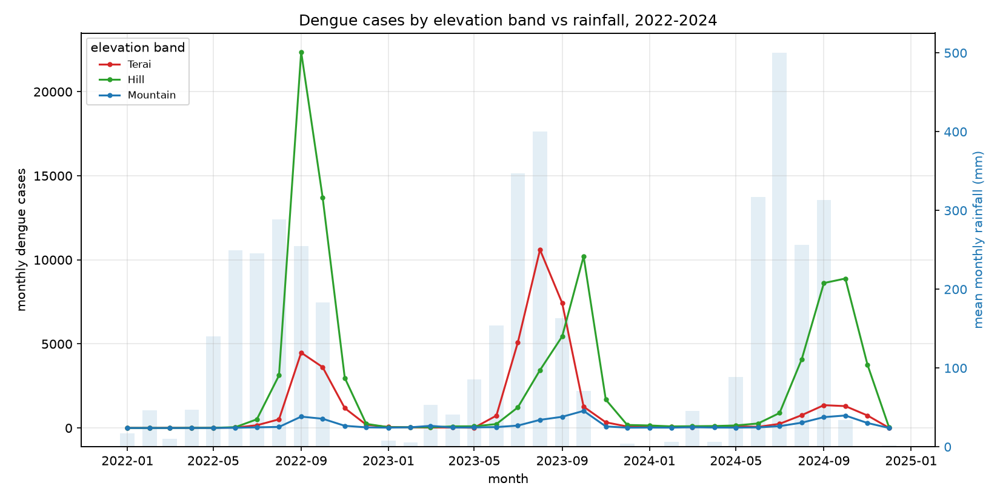
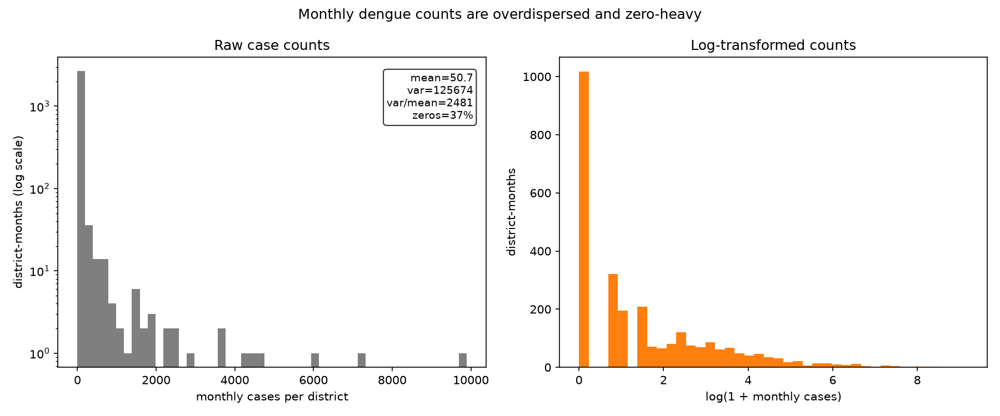
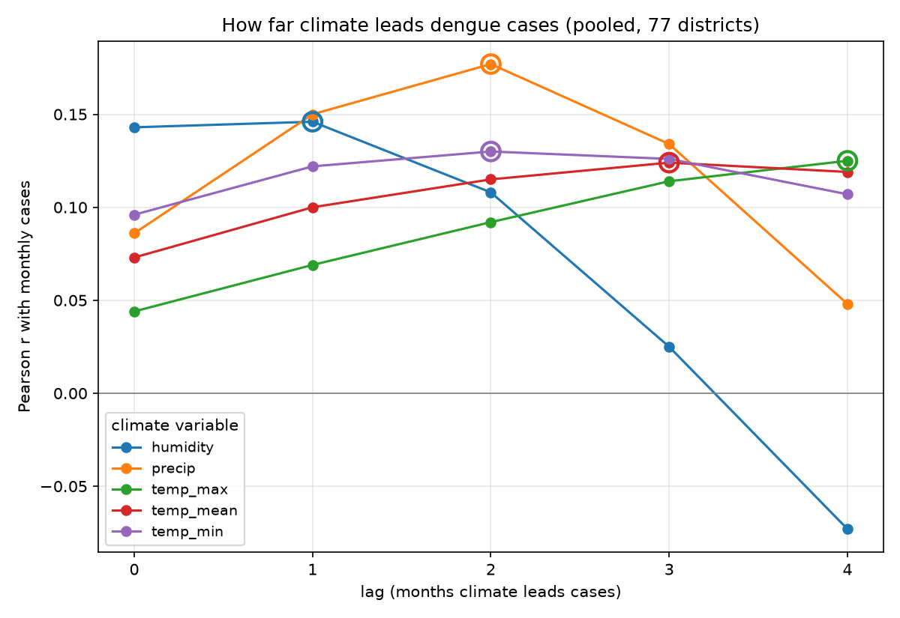
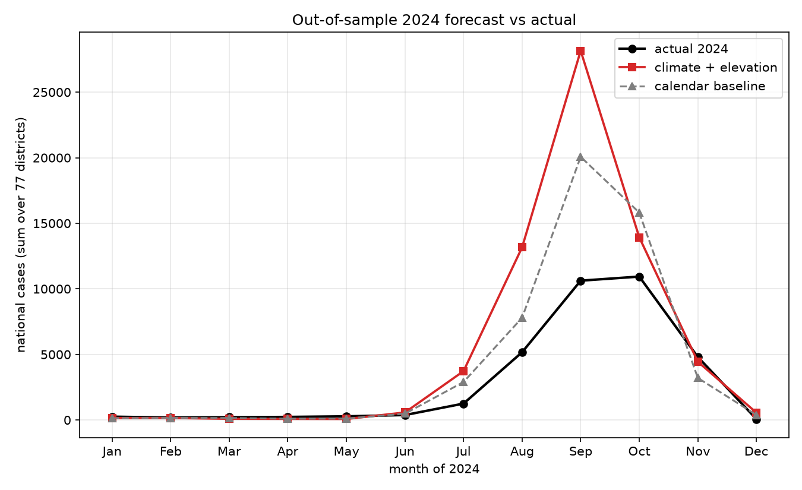

# Dengue and climate across Nepal's elevation gradient, 2022–2024

## Questions

1. How does monthly dengue incidence relate to rainfall, temperature, and humidity across Nepal's 77 districts?
2. Does that relationship change with **elevation** — are higher-altitude districts becoming newly dengue-suitable?
3. Can a model trained on 2022–2023 predict the 2024 monsoon season?

## Data

| source | what | resolution |
|---|---|---|
| OpenDengue | reported dengue cases, all 77 districts | monthly, 2022–2024 |
| NASA POWER | rainfall, temperature (mean/max/min), humidity | daily → aggregated to monthly |
| District HQ elevation | metres + band (Terai / Hill / Mountain) | per district |

The unit of analysis is the **district-month**: 77 districts × 36 months = **2,772 rows**. Three outbreak seasons were used (2020–21 dropped as COVID-disrupted, 2025 as a partial year). Statistical power therefore comes from the **77 districts**, not from the three years — a point that recurs in the limitations. Rainfall accumulates within a month (summed); temperature and humidity are monthly means. A month is kept only if ≥80% of its days are present.

Cases are heavily concentrated. The **Hill** belt carries **66%** of all cases, the Terai 29%, the Mountains 5%; the ten heaviest districts (led by Kathmandu, Sunsari, Lalitpur, Kaski) are mostly Hill-belt urban centres. The outbreak is a sharp **Jul–Oct surge** that peaks in **September** in the Terai and hills and a month later, in **October**, in the mountains — the first hint of an elevation lag.



## Methods

**Why negative binomial.** Monthly counts are zero-heavy (37% of district-months are zero) and badly overdispersed — variance ≈ 2,500× the mean. That rules out Poisson and motivates a **negative-binomial (NB2)** GLM.



**Lag selection.** Same-month climate–case correlations are weak (humidity strongest at r = 0.14), as expected if climate *leads* cases through the mosquito-breeding → transmission → reporting chain. Correlating cases against each variable shifted back 0–4 months — computed **within each district's own series** so nothing leaks across districts or year boundaries — shows a clear lead: **rainfall peaks at 2 months**, **humidity at 1**, minimum temperature at 2. The lead lengthens with altitude (rainfall's mountain correlation, r = 0.34 at lag 2, is the single strongest signal in the whole analysis).



**The model.** A pooled NB2 GLM on the district-month panel:

```
cases ~ (precip_lag2 + temp_min_lag2 + humidity_lag1)
        * elevation_band            # the climate × elevation interaction
        + C(month)                  # shared seasonal shape
```

One variable per climate family is used (the three temperature measures are collinear; minimum temperature carried the cleanest lagged signal). Climate predictors are standardised on the **training years only**, so coefficients read as "per one training-SD" and the 2024 test set never influences the fit. No population offset is available, so coefficients describe expected **case counts**, not per-capita incidence. Validation is genuinely out-of-sample: fit on **2022–2023** (1,694 district-months after lag warm-up), predict **2024** (924), and compare against a **calendar-only baseline** (month + band, no climate).

## Results

### 1. Climate relates to cases, but with a strong seasonal envelope

Calendar month dominates: relative to January, expected September cases are ~20× higher, October ~15×, consistent with the Jul–Oct surge. Against that backdrop, the lagged climate terms are significant and add real in-sample fit (ΔAIC = 116 in the model's favour).

### 2. The elevation gradient — the central finding (incidence-rate ratios)

The climate × elevation interaction is where the altitude story lives. IRRs are multiplicative effects on expected cases per **one training-SD** of each predictor (SDs: rainfall 137 mm, min-temp 8.6 °C, humidity 17 pp).

| predictor | Terai (reference) | Hill (interaction) | Mountain (interaction) |
|---|---|---|---|
| **min temperature** (lag 2) | **5.83**× ✓ | 0.65 (×) | **0.20**× ✓ |
| **rainfall** (lag 2) | 0.76 (ns) | **1.66**× ✓ | **1.87**× ✓ |
| **humidity** (lag 1) | **1.64**× ✓ | 0.87 (ns) | **0.53**× ✓ |

*(✓ = 95% CI excludes 1; interaction columns multiply the Terai effect.)*

Two clean, opposing gradients emerge:

- **Warmth gates the mountains.** A 1-SD rise in minimum temperature multiplies expected Terai cases ~5.8×, but the mountain interaction (0.20, CI 0.12–0.34) collapses that almost to nothing — high-altitude cold still caps transmission even when other conditions are favourable.
- **Rainfall matters *more* with altitude.** Its effect is flat-to-negative in the already-wet Terai but turns significantly positive in the hills (1.66×) and mountains (1.87×).

Read together, that is the upward-suitability signal: **temperature is the binding constraint at altitude, and where warmth permits, rainfall increasingly governs** — alongside the observed one-month-later peak in the mountains. Higher districts are not yet Terai-like, but the climate–dengue machinery is demonstrably *engaged* there, not absent.

### 3. Predicting 2024 — honest validation

In-sample, climate beats the calendar (ΔAIC = 116). **Out-of-sample it does not.**

| model | in-sample AIC | 2024 MAE | 2024 RMSE |
|---|---|---|---|
| climate + elevation | **10,431** | 70.8 | 198.0 |
| calendar baseline | 10,547 | **61.5** | **192.0** |



The 2024 season was **substantially smaller** than 2022–2023 (national September cases ~10.6k actual vs the model's ~28k expectation). Both models — trained on two large outbreak years — over-forecast the peak, and the richer climate model over-forecasts it *more*. With only three years, the panel cannot anticipate a low-incidence year; that is a property of the data, not a coding fault. **The deliverable is explanatory, not a production forecaster.**

## Limitations

- **Three-year panel.** Power comes from the 77 districts, not the years; the model cannot learn year-to-year level shifts, which is exactly why it over-predicts the smaller 2024 season.
- **Monthly resolution.** Lags are detectable only to ~1 month; finer lead–lag structure is invisible.
- **One NASA POWER grid-point per district** (~50 km) approximates each district's climate, especially crude in topographically complex hill/mountain districts.
- **Surveillance under-reporting**, and **no population offset** (counts, not incidence) — case totals reflect both true burden and reporting/health-access differences across the gradient.
- **Correlation, not causation.** Urbanisation, human mobility, and vector-control effort also drive spread and are unmeasured here; the Hill belt's dominance is partly an urban-population effect, not climate alone.

## Reproducibility

Every table and figure is regenerated from the raw inputs by a single command:

```bash
uv run python main.py all
```

This runs the deterministic chain — monthly climate → dengue panel → unified analysis panel → EDA → lag analysis → model — with no network access (the two API-fetched inputs are saved under `data/interim/` and `data/raw/reference/`). Deleting `data/processed/` and `outputs/` and re-running reproduces every number in this report, including the IRRs and validation metrics above.
